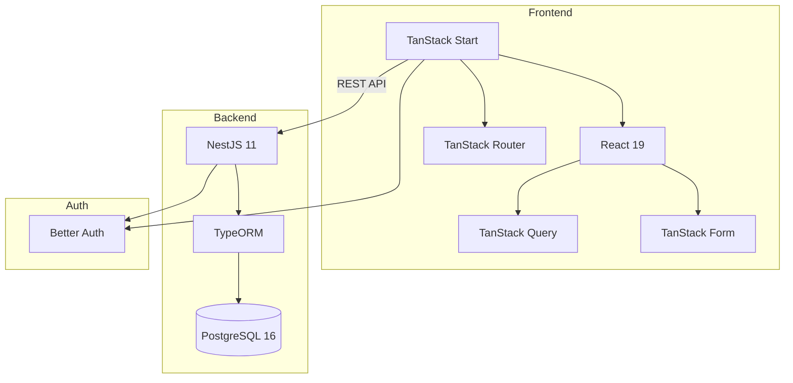
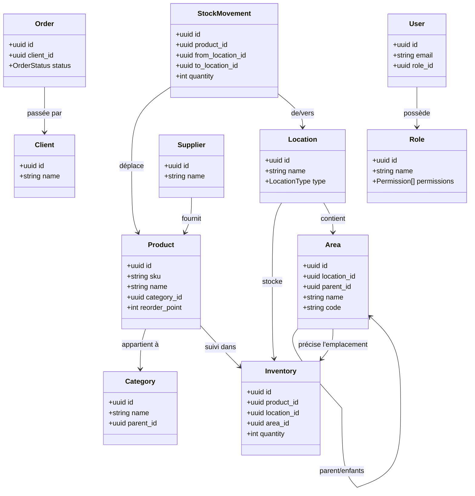

# Architecture

## Vue d'Ensemble du Systeme



## Stack Technique

| Couche | Technologie |
|--------|-------------|
| Frontend | TanStack Start, React 19, TanStack Router, TanStack Query/Form, Tailwind CSS 4, Radix UI |
| Backend | NestJS 11, TypeORM, PostgreSQL 16 |
| Auth | Better Auth |
| Docs API | Swagger UI |
| Outillage | pnpm workspaces, Nix flakes, TypeScript, Docker Compose |
| i18n | i18next (en, de, fr) |

## Structure des Repos

```
librestock/
├── backend/                # Backend NestJS
│   ├── src/
│   │   ├── routes/         # Modules fonctionnels
│   │   └── common/         # Utilitaires partagés
│   └── flake.nix           # Environnement dev Nix
├── frontend/               # Frontend TanStack Start
│   ├── src/
│   │   ├── routes/         # Routes basées sur les fichiers
│   │   ├── components/     # Composants React
│   │   └── lib/            # Utilitaires et hooks de données
│   └── flake.nix           # Environnement dev Nix
├── packages/
│   ├── tsconfig/           # Configs TS partagées
│   ├── eslint-config/      # Config ESLint partagée
│   └── types/              # Interfaces/enums DTO partagés
├── documentation/          # Documentation MkDocs
└── meta/                   # Scripts d'orchestration, Docker Compose
```

## Flux de Donnees

```
┌─────────────────────────────────────────┐
│           Frontend TanStack Start       │
│  React Query + clients écrits à la main │
│  DTO partagés via @librestock/types     │
│  Better Auth                            │
└─────────────────────────────────────────┘
                    ▼ HTTP/REST
┌─────────────────────────────────────────┐
│            Backend NestJS               │
│  Controller → Service → Repository      │
│  AuthGuard · PermissionGuard · TypeORM  │
│  HateoasInterceptor · Swagger UI        │
└─────────────────────────────────────────┘
                    ▼
┌─────────────────────────────────────────┐
│             PostgreSQL                  │
└─────────────────────────────────────────┘
```

## Flux d'Authentification

```
Utilisateur → Better Auth → Token JWT
                              ↓
Frontend: Authorization: Bearer {token}
                              ↓
Backend: AuthGuard → vérifier → req.auth.userId
```

## Modules de Routes Backend

Le backend possède les modules de routes suivants dans `backend/src/routes/` :

| Module | Objectif |
|--------|----------|
| **areas** | Zones au sein des emplacements (étagères, bacs, etc.) |
| **audit-logs** | Piste d'audit pour toutes les modifications d'entités |
| **auth** | Endpoints d'authentification (Better Auth) |
| **branding** | Paramètres de personnalisation/marque |
| **categories** | Catégorisation hiérarchique des produits |
| **clients** | Gestion des clients |
| **health** | Endpoints de vérification de santé (liveness, readiness) |
| **inventory** | Quantités de stock par emplacement/zone |
| **locations** | Emplacements physiques (entrepôts, etc.) |
| **orders** | Gestion des commandes |
| **photos** | Gestion des photos/images pour les produits |
| **products** | Catalogue de produits (SKU, nom, catégorie) |
| **roles** | Gestion des rôles et permissions |
| **stock-movements** | Suivi des mouvements de stock (transferts, ajustements) |
| **suppliers** | Gestion des fournisseurs |
| **users** | Gestion des utilisateurs |

## Répertoires Common du Backend

Utilitaires partagés dans `backend/src/common/` :

| Répertoire | Objectif |
|------------|----------|
| **auth** | Utilitaires d'authentification |
| **decorators** | `@Auditable`, `@RequirePermission`, `@StandardThrottle`, `@Transactional` |
| **dto** | DTOs de base/partagés |
| **entities** | `BaseEntity`, `BaseAuditEntity` |
| **enums** | Énumérations partagées |
| **filters** | Filtres d'exception |
| **guards** | `PermissionGuard` |
| **hateoas** | Système de liens HATEOAS, `HateoasInterceptor` |
| **interceptors** | Intercepteurs de réponse |
| **middleware** | Middleware HTTP |
| **utils** | Utilitaires généraux |

## Workflow des Types Partagés

Les interfaces/enums DTO partagés sont le contrat entre frontend et backend :

```bash
# 1. Générer les exports barrel
pnpm --filter @librestock/types barrels

# 2. Build des types partagés
pnpm --filter @librestock/types build
```

!!! warning "Garder les types alignés"
    Assurez-vous que les DTO backend et les hooks frontend correspondent à `packages/types`.

## Modèle de Domaine



### Entités Principales

| Entité | Objectif |
|--------|----------|
| **Product** | Article du catalogue (quoi) - SKU, nom, catégorie, seuil de réapprovisionnement |
| **Category** | Organisation hiérarchique des produits |
| **Location** | Lieu physique (où) - entrepôt, fournisseur, client, en transit |
| **Area** | Zone au sein d'un emplacement (où exactement) - étagère, bac, chambre froide |
| **Inventory** | Quantité de stock (combien) d'un produit à un emplacement/zone |
| **Client** | Client qui passe des commandes |
| **Supplier** | Fournisseur externe approvisionnant en produits |
| **Order** | Commande client pour des produits |
| **StockMovement** | Enregistrement des transferts, ajustements et mouvements de stock |
| **Role** | Ensemble nommé de permissions pour l'autorisation |
| **User** | Utilisateur du système avec un rôle assigné |
| **Photo** | Image associée à un produit |
| **AuditLog** | Enregistrement des modifications d'entités pour la piste d'audit |

### Décisions de Conception

1. **Séparation Product vs Inventory** - Les produits définissent ce qu'est un article. L'inventaire suit les quantités par emplacement.
2. **Types d'emplacement** - `WAREHOUSE`, `SUPPLIER`, `IN_TRANSIT`, `CLIENT` décrivent la catégorie de lieu.
3. **Les zones sont optionnelles** - L'inventaire peut référencer uniquement un emplacement, ou optionnellement une zone pour un suivi précis.
4. **Hiérarchie des zones** - Les zones supportent les relations parent-enfant (Zone A -> Étagère A1 -> Bac A1-1).
5. **Contrainte d'unicité** - Un seul enregistrement d'inventaire par combinaison (produit, emplacement, zone).
6. **Auth basée sur les permissions** - Les rôles contiennent des permissions granulaires ; `@RequirePermission` applique le contrôle d'accès par endpoint.

## Patterns Clés

| Pattern | Emplacement | Objectif |
|---------|-------------|----------|
| Repository | `backend/src/routes/*/` | Couche d'accès aux données |
| Service | `backend/src/routes/*/` | Logique métier |
| BaseAuditEntity | `backend/src/common/entities/` | Suppression douce + champs d'audit |
| AuthGuard | `backend/src/common/auth/` | Vérification JWT (Better Auth) |
| PermissionGuard | `backend/src/common/guards/` | Autorisation basée sur les permissions |
| @RequirePermission | `backend/src/common/decorators/` | Déclarer la permission requise sur un endpoint |
| @Auditable | `backend/src/common/decorators/` | Décorateur de journalisation d'audit |
| @Transactional | `backend/src/common/decorators/` | Wrapper de transaction de base de données |
| HATEOAS | `backend/src/common/hateoas/` | Liens hypermédia REST |
| DTO partagés | `packages/types/src/` | Contrats backend/frontend |
