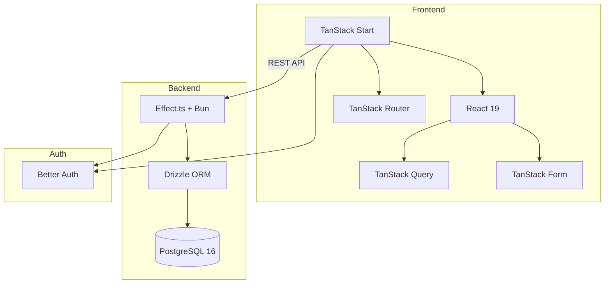
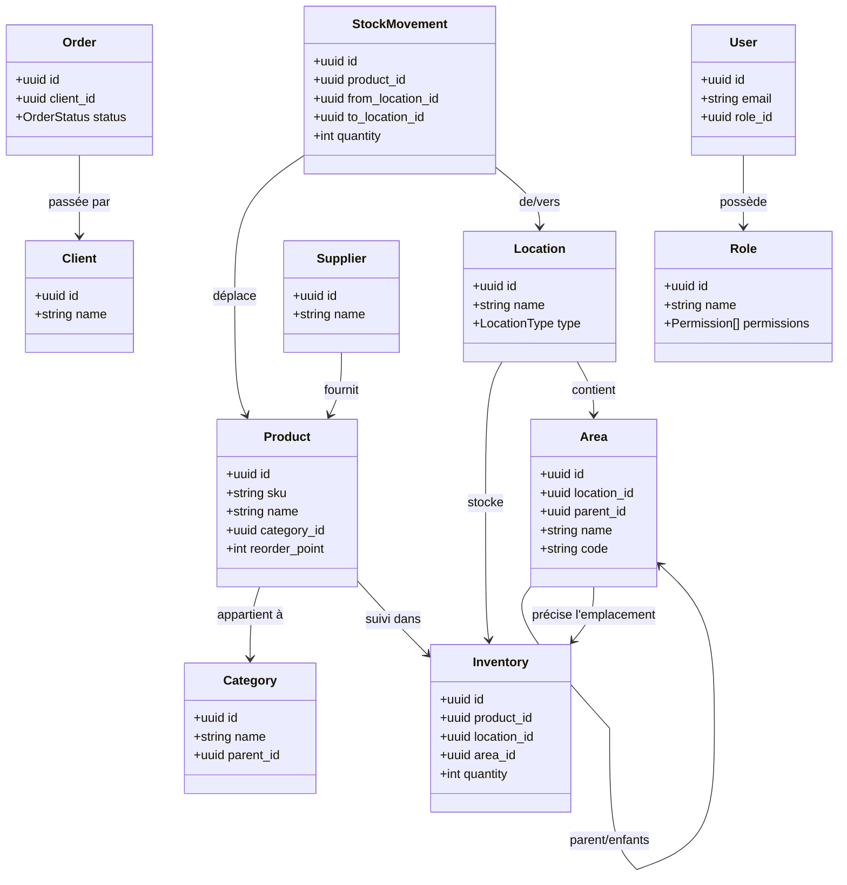

# Architecture

## Vue d'Ensemble du Systeme


```mermaid
graph TB
    subgraph "Frontend"
        A[TanStack Start] --> B[React 19]
        A --> E[TanStack Router]
        B --> C[TanStack Query]
        B --> D[TanStack Form]
    end

    subgraph "Backend"
        F[Effect.ts + Bun] --> G[Drizzle ORM]
        G --> H[(PostgreSQL 16)]
    end

    subgraph "Auth"
        I[Better Auth]
    end

    A -->|REST API| F
    A --> I
    F --> I
```

## Stack Technique

| Couche | Technologie |
|--------|-------------|
| Frontend | TanStack Start, React 19, TanStack Router, TanStack Query/Form, Tailwind CSS 4, Radix UI |
| Backend | Effect.ts, Drizzle ORM, Bun, PostgreSQL 16 |
| Auth | Better Auth |
| Docs API | Effect HttpApi (OpenAPI) |
| Outillage | pnpm workspaces, Nix flakes, TypeScript, Docker Compose |
| i18n | i18next (en, de, fr) |

## Structure des Repos

```
librestock/
├── backend/                # Backend Effect.ts (runtime Bun)
│   ├── src/
│   │   └── effect/
│   │       ├── modules/    # Modules fonctionnels
│   │       ├── platform/   # Concerns transversaux
│   │       └── http/       # App HTTP & middleware
│   └── flake.nix           # Environnement dev Nix
├── frontend/               # Frontend TanStack Start
│   ├── src/
│   │   ├── routes/         # Routes basées sur les fichiers
│   │   ├── components/     # Composants React
│   │   └── lib/            # Utilitaires et hooks de données
│   └── flake.nix           # Environnement dev Nix
├── packages/
│   ├── tsconfig/           # Configs TS partagées
│   ├── eslint-config/      # Config ESLint partagée
│   └── types/              # Interfaces/enums DTO partagés
├── documentation/          # Documentation MkDocs
└── meta/                   # Scripts d'orchestration, Docker Compose
```

## Flux de Donnees

```
┌─────────────────────────────────────────┐
│           Frontend TanStack Start       │
│  React Query + clients écrits à la main │
│  DTO partagés via @librestock/types     │
│  Better Auth                            │
└─────────────────────────────────────────┘
                    ▼ HTTP/REST
┌─────────────────────────────────────────┐
│          Backend Effect.ts (Bun)        │
│  Router → Service → Repository          │
│  requireSession · requirePermission     │
│  Drizzle ORM · HATEOAS · Audit Logging  │
└─────────────────────────────────────────┘
                    ▼
┌─────────────────────────────────────────┐
│             PostgreSQL                  │
└─────────────────────────────────────────┘
```

## Flux d'Authentification

```
Utilisateur → Better Auth → Cookie de session
                              ↓
Frontend: Session basée sur les cookies
                              ↓
Backend: requireSession → vérifier → userId depuis la session
```

## Modules de Routes Backend

Le backend possède les modules suivants dans `backend/src/effect/modules/` :

| Module | Objectif |
|--------|----------|
| **areas** | Zones au sein des emplacements (étagères, bacs, etc.) |
| **audit-logs** | Piste d'audit pour toutes les modifications d'entités |
| **auth** | Endpoints d'authentification (Better Auth) |
| **branding** | Paramètres de personnalisation/marque |
| **categories** | Catégorisation hiérarchique des produits |
| **clients** | Gestion des clients |
| **health** | Endpoints de vérification de santé (liveness, readiness) |
| **inventory** | Quantités de stock par emplacement/zone |
| **locations** | Emplacements physiques (entrepôts, etc.) |
| **orders** | Gestion des commandes |
| **photos** | Gestion des photos/images pour les produits |
| **products** | Catalogue de produits (SKU, nom, catégorie) |
| **roles** | Gestion des rôles et permissions |
| **stock-movements** | Suivi des mouvements de stock (transferts, ajustements) |
| **suppliers** | Gestion des fournisseurs |
| **users** | Gestion des utilisateurs |

## Couche Plateforme du Backend

Infrastructure partagée dans `backend/src/effect/platform/` :

| Répertoire / Fichier | Objectif |
|----------------------|----------|
| **authorization.ts** | Effect `requirePermission(resource, permission)` |
| **permission-provider.ts** | Recherche de permissions avec cache (TTL 1 min) |
| **session.ts** | Effects `requireSession`, `getOptionalSession` |
| **better-auth.ts** | Intégration Better Auth (APIs admin) |
| **errors.ts** | Factories d'erreurs de domaine (`NotFoundError`, `BadRequestError`, etc.) |
| **messages.ts** | Système de messages localisés (en, fr, de) |
| **audit.ts** | Écriture d'audit fire-and-forget |
| **drizzle.ts** | Couche Drizzle ORM avec pool de connexions |
| **hateoas.ts** | Utilitaires de liens HATEOAS |
| **request-context.ts** | ID de requête, chemin, méthode, IP, locale |
| **db/** | Définitions de schéma, relations, migrations |

## Workflow des Types Partagés

Les interfaces/enums DTO partagés sont le contrat entre frontend et backend :

```bash
# 1. Générer les exports barrel
pnpm --filter @librestock/types barrels

# 2. Build des types partagés
pnpm --filter @librestock/types build
```

!!! warning "Garder les types alignés"
    Assurez-vous que les DTO backend et les hooks frontend correspondent à `packages/types`.

## Modèle de Domaine


```mermaid
classDiagram
    class Product {
        +uuid id
        +string sku
        +string name
        +uuid category_id
        +int reorder_point
    }

    class Location {
        +uuid id
        +string name
        +LocationType type
    }

    class Area {
        +uuid id
        +uuid location_id
        +uuid parent_id
        +string name
        +string code
    }

    class Inventory {
        +uuid id
        +uuid product_id
        +uuid location_id
        +uuid area_id
        +int quantity
    }

    class Category {
        +uuid id
        +string name
        +uuid parent_id
    }

    class Client {
        +uuid id
        +string name
    }

    class Supplier {
        +uuid id
        +string name
    }

    class Order {
        +uuid id
        +uuid client_id
        +OrderStatus status
    }

    class StockMovement {
        +uuid id
        +uuid product_id
        +uuid from_location_id
        +uuid to_location_id
        +int quantity
    }

    class Role {
        +uuid id
        +string name
        +Permission[] permissions
    }

    class User {
        +uuid id
        +string email
        +uuid role_id
    }

    Product --> Category : appartient à
    Product --> Inventory : suivi dans
    Location --> Inventory : stocke
    Location --> Area : contient
    Area --> Area : parent/enfants
    Area --> Inventory : précise l'emplacement
    Order --> Client : passée par
    Supplier --> Product : fournit
    StockMovement --> Product : déplace
    StockMovement --> Location : de/vers
    User --> Role : possède
```

### Entités Principales

| Entité | Objectif |
|--------|----------|
| **Product** | Article du catalogue (quoi) - SKU, nom, catégorie, seuil de réapprovisionnement |
| **Category** | Organisation hiérarchique des produits |
| **Location** | Lieu physique (où) - entrepôt, fournisseur, client, en transit |
| **Area** | Zone au sein d'un emplacement (où exactement) - étagère, bac, chambre froide |
| **Inventory** | Quantité de stock (combien) d'un produit à un emplacement/zone |
| **Client** | Client qui passe des commandes |
| **Supplier** | Fournisseur externe approvisionnant en produits |
| **Order** | Commande client pour des produits |
| **StockMovement** | Enregistrement des transferts, ajustements et mouvements de stock |
| **Role** | Ensemble nommé de permissions pour l'autorisation |
| **User** | Utilisateur du système avec un rôle assigné |
| **Photo** | Image associée à un produit |
| **AuditLog** | Enregistrement des modifications d'entités pour la piste d'audit |

### Décisions de Conception

1. **Séparation Product vs Inventory** - Les produits définissent ce qu'est un article. L'inventaire suit les quantités par emplacement.
2. **Types d'emplacement** - `WAREHOUSE`, `SUPPLIER`, `IN_TRANSIT`, `CLIENT` décrivent la catégorie de lieu.
3. **Les zones sont optionnelles** - L'inventaire peut référencer uniquement un emplacement, ou optionnellement une zone pour un suivi précis.
4. **Hiérarchie des zones** - Les zones supportent les relations parent-enfant (Zone A -> Étagère A1 -> Bac A1-1).
5. **Contrainte d'unicité** - Un seul enregistrement d'inventaire par combinaison (produit, emplacement, zone).
6. **Auth basée sur les permissions** - Les rôles contiennent des permissions granulaires ; l'Effect `requirePermission` applique le contrôle d'accès par endpoint.

## Patterns Clés

| Pattern | Emplacement | Objectif |
|---------|-------------|----------|
| Repository | `backend/src/effect/modules/*/` | Accès aux données via Drizzle ORM |
| Service | `backend/src/effect/modules/*/` | Logique métier comme services Effect |
| Router | `backend/src/effect/modules/*/` | Gestionnaires de routes HTTP |
| requireSession | `backend/src/effect/platform/` | Vérification de session Effect |
| requirePermission | `backend/src/effect/platform/` | Autorisation basée sur les permissions |
| AuditLogWriter | `backend/src/effect/platform/` | Journalisation d'audit fire-and-forget |
| Erreurs de domaine | `backend/src/effect/platform/` | Factories d'erreurs HTTP typées |
| HATEOAS | `backend/src/effect/platform/` | Liens hypermédia REST |
| Composition de Layers | `backend/src/effect/main.ts` | Injection de dépendances via les layers Effect |
| DTO partagés | `packages/types/src/` | Contrats backend/frontend |
