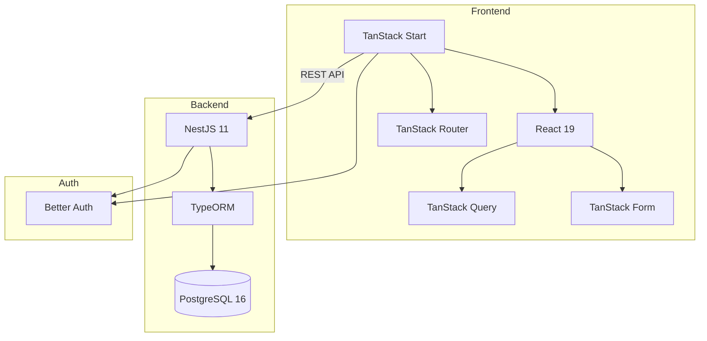
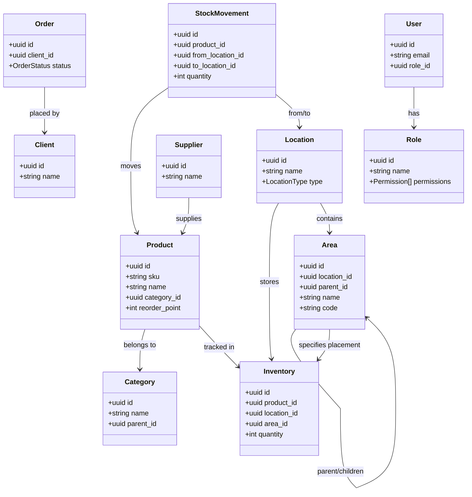

# Architecture

## System Overview



## Tech Stack

| Layer | Technology |
|-------|------------|
| Frontend | TanStack Start, React 19, TanStack Router, TanStack Query/Form, Tailwind CSS 4, Radix UI |
| Backend | NestJS 11, TypeORM, PostgreSQL 16 |
| Auth | Better Auth |
| API Docs | Swagger UI |
| Tooling | pnpm workspaces, Nix flakes, TypeScript, Docker Compose |
| i18n | i18next (en, de, fr) |

## Repository Structure

```
librestock/
├── backend/                # NestJS backend
│   ├── src/
│   │   ├── routes/         # Feature modules
│   │   └── common/         # Shared utilities
│   └── flake.nix           # Nix dev environment
├── frontend/               # TanStack Start frontend
│   ├── src/
│   │   ├── routes/         # File-based routes
│   │   ├── components/     # React components
│   │   └── lib/            # Utilities and data hooks
│   └── flake.nix           # Nix dev environment
├── packages/
│   ├── tsconfig/           # Shared TS configs
│   ├── eslint-config/      # Shared ESLint config
│   └── types/              # Shared DTO interfaces/enums
├── documentation/          # MkDocs documentation
└── meta/                   # Orchestration scripts, Docker Compose
```

## Data Flow

```
┌─────────────────────────────────────────┐
│           TanStack Start Frontend       │
│  React Query + handwritten clients       │
│  Shared DTOs from @librestock/types      │
│  Better Auth                             │
└─────────────────────────────────────────┘
                    ▼ HTTP/REST
┌─────────────────────────────────────────┐
│            NestJS Backend               │
│  Controller → Service → Repository      │
│  AuthGuard · PermissionGuard · TypeORM  │
│  HateoasInterceptor · Swagger UI        │
└─────────────────────────────────────────┘
                    ▼
┌─────────────────────────────────────────┐
│             PostgreSQL                  │
└─────────────────────────────────────────┘
```

## Authentication Flow

```
User → Better Auth → JWT Token
                       ↓
Frontend: Authorization: Bearer {token}
                       ↓
Backend: AuthGuard → verify → req.auth.userId
```

## Backend Route Modules

The backend has the following route modules in `backend/src/routes/`:

| Module | Purpose |
|--------|---------|
| **areas** | Zones within locations (shelves, bins, etc.) |
| **audit-logs** | Audit trail for all entity changes |
| **auth** | Authentication endpoints (Better Auth) |
| **branding** | Branding/customization settings |
| **categories** | Hierarchical product categorization |
| **clients** | Client/customer management |
| **health** | Health check endpoints (liveness, readiness) |
| **inventory** | Stock quantities at locations/areas |
| **locations** | Physical locations (warehouses, etc.) |
| **orders** | Order management |
| **photos** | Photo/image management for products |
| **products** | Product catalog (SKU, name, category) |
| **roles** | Role and permission management |
| **stock-movements** | Stock movement tracking (transfers, adjustments) |
| **suppliers** | Supplier management |
| **users** | User management |

## Backend Common Directories

Shared utilities in `backend/src/common/`:

| Directory | Purpose |
|-----------|---------|
| **auth** | Authentication utilities |
| **decorators** | `@Auditable`, `@RequirePermission`, `@StandardThrottle`, `@Transactional` |
| **dto** | Base/shared DTOs |
| **entities** | `BaseEntity`, `BaseAuditEntity` |
| **enums** | Shared enumerations |
| **filters** | Exception filters |
| **guards** | `PermissionGuard` |
| **hateoas** | HATEOAS link system, `HateoasInterceptor` |
| **interceptors** | Response interceptors |
| **middleware** | HTTP middleware |
| **utils** | General utilities |

## Shared-Types Workflow

Shared DTO interfaces/enums are the contract between frontend and backend:

```bash
# 1. Generate barrel exports
pnpm --filter @librestock/types barrels

# 2. Build shared types
pnpm --filter @librestock/types build
```

!!! warning "Keep shared types aligned"
    Ensure backend DTOs and frontend hooks match `packages/types`.

## Domain Model



### Core Entities

| Entity | Purpose |
|--------|---------|
| **Product** | Catalog item (what) - SKU, name, category, reorder point |
| **Category** | Hierarchical product organization |
| **Location** | Physical place (where) - warehouse, supplier, client, in-transit |
| **Area** | Zone within a location (where exactly) - shelf, bin, cold storage |
| **Inventory** | Stock quantity (how many) of a product at a location/area |
| **Client** | Customer who places orders |
| **Supplier** | External supplier providing products |
| **Order** | Customer order for products |
| **StockMovement** | Record of stock transfers, adjustments, and movements |
| **Role** | Named set of permissions for authorization |
| **User** | System user with assigned role |
| **Photo** | Image associated with a product |
| **AuditLog** | Record of entity changes for audit trail |

### Design Decisions

1. **Product vs Inventory separation** - Products define what an item is. Inventory tracks quantities at locations.
2. **Location types** - `WAREHOUSE`, `SUPPLIER`, `IN_TRANSIT`, `CLIENT` describe the category of place.
3. **Areas are optional** - Inventory can reference just a Location, or optionally an Area for precise tracking.
4. **Area hierarchy** - Areas support parent-child relationships (Zone A -> Shelf A1 -> Bin A1-1).
5. **Unique constraint** - One inventory record per (product, location, area) combination.
6. **Permission-based auth** - Roles contain granular permissions; `@RequirePermission` enforces access per endpoint.

## Key Patterns

| Pattern | Location | Purpose |
|---------|----------|---------|
| Repository | `backend/src/routes/*/` | Data access layer |
| Service | `backend/src/routes/*/` | Business logic |
| BaseAuditEntity | `backend/src/common/entities/` | Soft delete + audit fields |
| AuthGuard | `backend/src/common/auth/` | JWT verification (Better Auth) |
| PermissionGuard | `backend/src/common/guards/` | Permission-based authorization |
| @RequirePermission | `backend/src/common/decorators/` | Declare required permission on endpoint |
| @Auditable | `backend/src/common/decorators/` | Audit logging decorator |
| @Transactional | `backend/src/common/decorators/` | Database transaction wrapper |
| HATEOAS | `backend/src/common/hateoas/` | REST hypermedia links |
| Shared DTOs | `packages/types/src/` | Backend/Frontend contracts |
