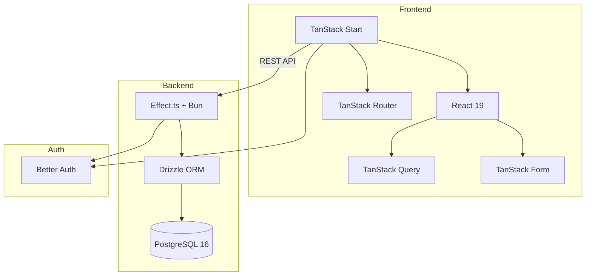
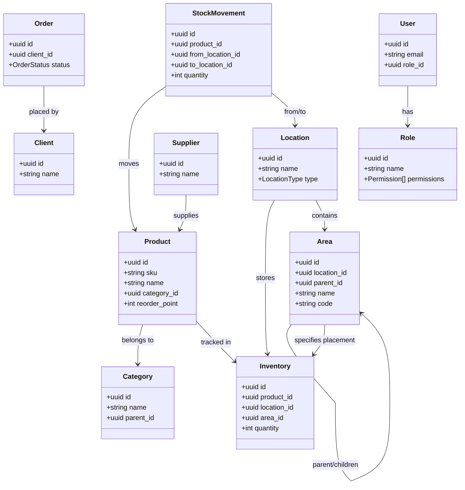

# Architecture

## System Overview


```mermaid
graph TB
    subgraph "Frontend"
        A[TanStack Start] --> B[React 19]
        A --> E[TanStack Router]
        B --> C[TanStack Query]
        B --> D[TanStack Form]
    end

    subgraph "Backend"
        F[Effect.ts + Bun] --> G[Drizzle ORM]
        G --> H[(PostgreSQL 16)]
    end

    subgraph "Auth"
        I[Better Auth]
    end

    A -->|REST API| F
    A --> I
    F --> I
```

## Tech Stack

| Layer | Technology |
|-------|------------|
| Frontend | TanStack Start, React 19, TanStack Router, TanStack Query/Form, Tailwind CSS 4, Radix UI |
| Backend | Effect.ts, Drizzle ORM, Bun, PostgreSQL 16 |
| Auth | Better Auth |
| API Docs | Effect HttpApi (OpenAPI) |
| Tooling | pnpm workspaces, Nix flakes, TypeScript, Docker Compose |
| i18n | i18next (en, de, fr) |

## Repository Structure

LibreStock is a pnpm monorepo. All packages live under one workspace root with a single `pnpm-lock.yaml`.

```
librestock/
├── backend/                # Effect.ts API (Bun runtime, @librestock/api)
│   ├── src/
│   │   └── effect/
│   │       ├── modules/    # Feature modules
│   │       ├── platform/   # Cross-cutting concerns
│   │       └── http/       # HTTP app & middleware
│   └── flake.nix           # Per-package Nix dev shell (optional)
├── frontend/               # TanStack Start SSR app (@librestock/web)
│   ├── src/
│   │   ├── routes/         # File-based routes (_authed/ for protected)
│   │   ├── components/     # React components
│   │   └── lib/            # Utilities and data hooks
│   └── flake.nix           # Per-package Nix dev shell (optional)
├── mobile-app/             # Expo React Native app (@librestock/mobile)
├── landing/                # Static marketing site
├── remote-desktop/         # Tauri 2 desktop app (@librestock/remote-desktop)
├── packages/
│   ├── tsconfig/           # Shared TS configs (base.json, nestjs.json)
│   ├── eslint-config/      # Shared ESLint config (legacy; not consumed today)
│   └── types/              # Shared DTO interfaces/enums (@librestock/types)
├── documentation/          # MkDocs documentation site (this site)
├── meta/                   # docker-compose.yml, legacy multi-repo scripts
├── infrastructure/         # Terraform (Hetzner + Cloudflare; not a workspace member)
├── pnpm-workspace.yaml     # Single workspace definition
└── pnpm-lock.yaml          # Single lockfile for the whole monorepo
```

## Data Flow

```
┌─────────────────────────────────────────┐
│           TanStack Start Frontend       │
│  React Query + handwritten clients       │
│  Shared DTOs from @librestock/types      │
│  Better Auth                             │
└─────────────────────────────────────────┘
                    ▼ HTTP/REST
┌─────────────────────────────────────────┐
│          Effect.ts Backend (Bun)        │
│  Router → Service → Repository          │
│  requireSession · requirePermission     │
│  Drizzle ORM · HATEOAS · Audit Logging  │
└─────────────────────────────────────────┘
                    ▼
┌─────────────────────────────────────────┐
│             PostgreSQL                  │
└─────────────────────────────────────────┘
```

## Authentication Flow

```
User → Better Auth → Session Cookie
                       ↓
Frontend: Cookie-based session
                       ↓
Backend: requireSession → verify → userId from session
```

## Backend Route Modules

The backend has the following modules in `backend/src/effect/modules/`:

| Module | Purpose |
|--------|---------|
| **areas** | Zones within locations (shelves, bins, etc.) |
| **audit-logs** | Audit trail for all entity changes |
| **auth** | Authentication endpoints (Better Auth) |
| **branding** | Branding/customization settings |
| **categories** | Hierarchical product categorization |
| **clients** | Client/customer management |
| **fulfillment** | Order fulfillment, packing, and shipment tracking |
| **health** | Health check endpoints (liveness, readiness) |
| **inventory** | Stock quantities at locations/areas |
| **locations** | Physical locations (warehouses, etc.) |
| **orders** | Order management |
| **photos** | Photo/image management for products |
| **products** | Product catalog (SKU, name, category) |
| **roles** | Role and permission management |
| **stock-movements** | Stock movement tracking (transfers, adjustments) |
| **suppliers** | Supplier management |
| **users** | User management |

## Backend Platform Layer

Shared infrastructure in `backend/src/effect/platform/`:

| Directory / File | Purpose |
|------------------|---------|
| **authorization.ts** | `requirePermission(resource, permission)` Effect |
| **permission-provider.ts** | Cached permission lookups (1-min TTL) |
| **session.ts** | `requireSession`, `getOptionalSession` Effects |
| **better-auth.ts** | Better Auth integration (admin APIs) |
| **errors.ts** | Domain error factories (`NotFoundError`, `BadRequestError`, etc.) + `respondJson` / `respondEmpty` |
| **domain-errors.ts** | `isAppError` classification for typed error guards |
| **messages.ts** | Localized message system + `LogProperties` type definitions |
| **catalogs/** | Message catalogs per locale (`en.ts`, `fr.ts`, `de.ts`); `en.ts` is the source of truth for `MessageKey` |
| **console-logging.ts** | Structured logging setup (`createLogger(scope)`) |
| **audit.ts** | Fire-and-forget audit log writer |
| **drizzle.ts** | Drizzle ORM database layer with connection pooling |
| **drizzle-query.utils.ts** | Drizzle query helpers |
| **drizzle-sort.utils.ts** | Sort-by utilities for list endpoints |
| **hateoas.ts** | HATEOAS link utilities |
| **pagination.utils.ts** | `toPaginatedResponse` and pagination helpers |
| **bulk-operation.utils.ts** | `createBulkResultBuilder`, `findDuplicates`, `partitionByExistence` |
| **service-tracer.ts** | `makeServiceTracer` — the project's chosen tracing abstraction |
| **try-async.ts** | `makeTryAsync` — promise-to-Effect wrapper that maps to module infrastructure errors |
| **from-null-or.ts** | Null coercion helper |
| **request-context.ts** | Request ID, path, method, IP, locale |
| **tracing.ts** | OpenTelemetry exporter wiring |
| **db/** | Schema definitions, relations, migrations |

!!! warning "Tracing abstraction is not `Effect.fn`"
    `makeServiceTracer` captures outcome classification (`not_found` / `validation_error` / `failure`) and request-context attributes that `Effect.fn("span")` does not. **Do not migrate service methods to `Effect.fn`** — the service tracer was deliberately rebuilt for this purpose.

## Shared-Types Workflow

Shared DTO interfaces/enums are the contract between frontend and backend:

```bash
# 1. Generate barrel exports
pnpm --filter @librestock/types barrels

# 2. Build shared types
pnpm --filter @librestock/types build
```

!!! warning "Keep shared types aligned"
    Ensure backend DTOs and frontend hooks match `packages/types`.

## Domain Model


```mermaid
classDiagram
    class Product {
        +uuid id
        +string sku
        +string name
        +uuid category_id
        +int reorder_point
    }

    class Location {
        +uuid id
        +string name
        +LocationType type
    }

    class Area {
        +uuid id
        +uuid location_id
        +uuid parent_id
        +string name
        +string code
    }

    class Inventory {
        +uuid id
        +uuid product_id
        +uuid location_id
        +uuid area_id
        +int quantity
    }

    class Category {
        +uuid id
        +string name
        +uuid parent_id
    }

    class Client {
        +uuid id
        +string name
    }

    class Supplier {
        +uuid id
        +string name
    }

    class Order {
        +uuid id
        +uuid client_id
        +OrderStatus status
    }

    class StockMovement {
        +uuid id
        +uuid product_id
        +uuid from_location_id
        +uuid to_location_id
        +int quantity
    }

    class Role {
        +uuid id
        +string name
        +Permission[] permissions
    }

    class User {
        +uuid id
        +string email
        +uuid role_id
    }

    Product --> Category : belongs to
    Product --> Inventory : tracked in
    Location --> Inventory : stores
    Location --> Area : contains
    Area --> Area : parent/children
    Area --> Inventory : specifies placement
    Order --> Client : placed by
    Supplier --> Product : supplies
    StockMovement --> Product : moves
    StockMovement --> Location : from/to
    User --> Role : has
```

### Core Entities

| Entity | Purpose |
|--------|---------|
| **Product** | Catalog item (what) - SKU, name, category, reorder point |
| **Category** | Hierarchical product organization |
| **Location** | Physical place (where) - warehouse, supplier, client, in-transit |
| **Area** | Zone within a location (where exactly) - shelf, bin, cold storage |
| **Inventory** | Stock quantity (how many) of a product at a location/area |
| **Client** | Customer who places orders |
| **Supplier** | External supplier providing products |
| **Order** | Customer order for products |
| **StockMovement** | Record of stock transfers, adjustments, and movements |
| **Role** | Named set of permissions for authorization |
| **User** | System user with assigned role |
| **Photo** | Image associated with a product |
| **AuditLog** | Record of entity changes for audit trail |

### Design Decisions

1. **Product vs Inventory separation** - Products define what an item is. Inventory tracks quantities at locations.
2. **Location types** - `WAREHOUSE`, `SUPPLIER`, `IN_TRANSIT`, `CLIENT` describe the category of place.
3. **Areas are optional** - Inventory can reference just a Location, or optionally an Area for precise tracking.
4. **Area hierarchy** - Areas support parent-child relationships (Zone A -> Shelf A1 -> Bin A1-1).
5. **Unique constraint** - One inventory record per (product, location, area) combination.
6. **Permission-based auth** - Roles contain granular permissions; `requirePermission` Effect enforces access per endpoint.

## Key Patterns

| Pattern | Location | Purpose |
|---------|----------|---------|
| Repository | `backend/src/effect/modules/*/` | Data access via Drizzle ORM |
| Service | `backend/src/effect/modules/*/` | Business logic as Effect services |
| Router | `backend/src/effect/modules/*/` | HTTP route handlers |
| requireSession | `backend/src/effect/platform/` | Session verification Effect |
| requirePermission | `backend/src/effect/platform/` | Permission-based authorization |
| AuditLogWriter | `backend/src/effect/platform/` | Fire-and-forget audit logging |
| Domain Errors | `backend/src/effect/platform/` | Typed HTTP error factories |
| HATEOAS | `backend/src/effect/platform/` | REST hypermedia links |
| Layer Composition | `backend/src/effect/main.ts` | Dependency injection via Effect layers |
| Shared DTOs | `packages/types/src/` | Backend/Frontend contracts |
