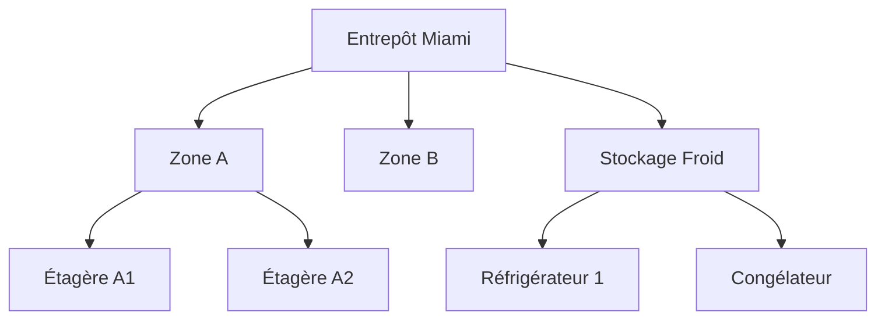

# Gestion des Zones

Les zones représentent des espaces spécifiques, des étagères ou des bacs au sein d'un Emplacement. Elles fournissent un suivi granulaire du placement pour les articles d'inventaire.

## Comprendre les Zones

Les zones sont hiérarchiques et appartiennent toujours à un Emplacement :

```
Emplacement : Entrepôt Miami
├── Zone : Zone A
│   ├── Zone : Étagère A1
│   ├── Zone : Étagère A2
│   └── Zone : Étagère A3
├── Zone : Zone B
│   └── Zone : Étagère B1
└── Zone : Stockage Froid
    ├── Zone : Réfrigérateur 1
    └── Zone : Congélateur
```

!!! info "Les Zones sont Optionnelles"
    L'inventaire peut être suivi uniquement au niveau de l'Emplacement. Les zones ajoutent de la précision lorsque vous avez besoin de savoir exactement où les articles sont placés.

## Affichage des Zones

Accédez à **Emplacements** → sélectionnez un emplacement → **Voir les Zones** pour voir toutes les zones au sein de cet emplacement.

La liste des zones affiche :

- **Nom** - Identifiant de la zone
- **Code** - Code court pour référence rapide
- **Parent** - Zone parente (si imbriquée)
- **Statut** - Actif ou inactif

!!! tip "Vue Hiérarchique"
    Basculez entre la liste plate et la vue arborescente pour voir la hiérarchie des zones.

## Création d'une Zone

1. Sélectionnez un emplacement
2. Cliquez sur le bouton **Créer une Zone**
3. Remplissez les champs obligatoires :
   - **Nom** - Nom de la zone (ex. : "Étagère A1")
   - **Code** - Identifiant court (ex. : "A1")
   - **Parent** - Zone parente pour l'imbrication (optionnel)

### Champs de la Zone

| Champ | Requis | Description |
|-------|--------|-------------|
| Nom | Oui | Nom d'affichage de la zone |
| Emplacement | Oui | Emplacement parent (rempli automatiquement) |
| Zone Parente | Non | Zone parente pour la hiérarchie |
| Code | Non | Code identifiant court |
| Description | Non | Détails supplémentaires |
| Est Actif | Non | Disponibilité de la zone (par défaut vrai) |

## Création de Zones Imbriquées

Pour créer une hiérarchie :

1. Créez d'abord la zone parente (ex. : "Zone A")
2. Créez les zones enfants avec le parent sélectionné (ex. : "Étagère A1" → Parent : "Zone A")
3. Continuez l'imbrication aussi profondément que nécessaire



## Modification des Zones

1. Cliquez sur une zone pour ouvrir le formulaire de modification
2. Modifiez les champs selon vos besoins
3. Cliquez sur **Enregistrer** pour appliquer les modifications

!!! warning "Déplacement des Zones"
    Changer le parent d'une zone déplacera également tous ses enfants. La zone doit rester au sein du même emplacement.

## Suppression des Zones

Lorsque vous supprimez une zone :

- **Les zones enfants sont également supprimées** (suppression en cascade)
- **Les enregistrements d'inventaire perdent leur référence de zone** (mise à null)
- L'inventaire reste au niveau de l'emplacement

!!! danger "Suppression en Cascade"
    Supprimer "Zone A" supprimera également "Étagère A1", "Étagère A2" et toutes les autres zones imbriquées.

## Bonnes Pratiques

1. **Utilisez un nommage cohérent** - "Étagère A1" et non "etagere-a1" ou "ETAGERE A1"
2. **Utilisez des codes pour une recherche rapide** - Des codes courts comme "A1", "B2", "SF" aident lors des inventaires
3. **N'imbriquez pas trop** - 2-3 niveaux suffisent généralement (Zone → Étagère → Bac)
4. **Reflétez l'agencement physique** - La structure des zones doit correspondre à l'agencement réel du stockage
