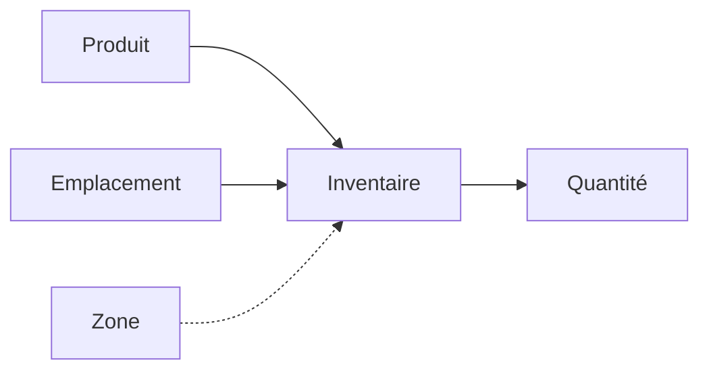

# Gestion de l'Inventaire

L'inventaire suit la quantité de produits à des emplacements et zones spécifiques. Il répond à la question : "Combien de ce produit se trouvent à cet endroit ?"

## Comprendre le Modèle d'Inventaire

- **Produit** - Ce qu'est l'article (depuis le catalogue)
- **Emplacement** - Où les articles sont stockés (entrepôt, fournisseur, etc.)
- **Zone** - Placement spécifique optionnel (étagère, bac)
- **Quantité** - Combien se trouvent à cet emplacement/zone

!!! info "Un Enregistrement Par Combinaison"
    Chaque combinaison unique de Produit + Emplacement + Zone possède un seul enregistrement d'inventaire. Utilisez le endpoint d'ajustement pour modifier les quantités.

## Affichage de l'Inventaire

Accédez à la section **Inventaire** depuis la barre latérale.

La liste d'inventaire affiche :

- **Produit** - SKU et nom
- **Emplacement** - Où se trouve l'inventaire
- **Zone** - Placement spécifique (si défini)
- **Quantité** - Niveau de stock actuel
- **Expiration** - Date d'expiration (pour les périssables)

### Filtrage de l'Inventaire

Filtrez l'inventaire par :

- **Produit** - Recherche par SKU ou nom
- **Emplacement** - Filtrer par emplacement
- **Zone** - Filtrer par zone
- **Stock Bas** - Afficher les articles sous le point de réapprovisionnement
- **Expiration Proche** - Afficher les articles expirant dans les 30 jours

## Ajout d'Inventaire

1. Cliquez sur le bouton **Ajouter de l'Inventaire**
2. Sélectionnez un produit
3. Sélectionnez un emplacement
4. Sélectionnez optionnellement une zone au sein de cet emplacement
5. Saisissez la quantité et les détails optionnels

### Champs de l'Inventaire

| Champ | Requis | Description |
|-------|--------|-------------|
| Produit | Oui | Produit du catalogue |
| Emplacement | Oui | Emplacement de stockage |
| Zone | Non | Zone spécifique au sein de l'emplacement |
| Quantité | Oui | Nombre d'articles |
| Numéro de Lot | Non | Numéro de lot ou de série |
| Date d'Expiration | Non | Date d'expiration |
| Coût Unitaire | Non | Coût d'achat |
| Date de Réception | Non | Date de réception de l'inventaire |

!!! warning "Prévention des Doublons"
    Vous ne pouvez pas créer deux enregistrements d'inventaire pour le même produit au même emplacement/zone. Mettez à jour l'enregistrement existant à la place.

## Ajustement des Quantités

Utilisez la fonctionnalité **Ajuster** pour ajouter ou retirer de l'inventaire :

1. Cliquez sur le bouton d'ajustement sur une ligne d'inventaire
2. Saisissez le montant de l'ajustement :
   - Nombre positif pour ajouter (ex. : `+50`)
   - Nombre négatif pour retirer (ex. : `-10`)
3. Cliquez sur **Ajuster** pour appliquer

!!! tip "Ajustement vs Mise à Jour"
    Utilisez **Ajuster** pour les modifications incrémentales (réception d'expédition, articles vendus). Utilisez **Mettre à Jour** pour définir une quantité absolue (corrections d'inventaire physique).

## Déplacement d'Inventaire (Mouvements de Stock)

Le module Mouvements de Stock vous permet de suivre et d'enregistrer les transferts d'inventaire entre emplacements :

1. Accédez à **Mouvements de Stock**
2. Cliquez sur **Créer un Mouvement**
3. Sélectionnez l'emplacement source et l'emplacement de destination
4. Sélectionnez le produit et la quantité à transférer
5. Confirmez le mouvement

Les mouvements de stock fournissent une piste d'audit complète des transferts d'inventaire, facilitant le suivi de l'endroit où le stock a été déplacé et par qui.

## Alertes de Stock Bas

Les produits ont un **point de réapprovisionnement** qui déclenche des alertes de stock bas :

- Défini sur le produit (ex. : point de réapprovisionnement = 10)
- Lorsque la quantité en inventaire est inférieure ou égale au point de réapprovisionnement, l'article apparaît dans le filtre de stock bas
- Utilisez ceci pour savoir quand réapprovisionner auprès des fournisseurs

## Suivi des Dates d'Expiration

Pour les articles périssables :

1. Définissez **Est Périssable** sur le produit
2. Saisissez la **Date d'Expiration** lors de l'ajout d'inventaire
3. Utilisez le filtre "Expiration Proche" pour voir les articles expirant dans les 30 jours

## Inventaire sur Plusieurs Emplacements

Le même produit peut exister à plusieurs emplacements :

| Produit | Emplacement | Zone | Quantité |
|---------|-------------|------|----------|
| PROD-001 | Entrepôt Miami | Étagère A1 | 50 |
| PROD-001 | Entrepôt Miami | Étagère B2 | 25 |
| PROD-001 | Fournisseur Monaco | - | 100 |
| PROD-001 | Yacht Bella | - | 5 |

Cela vous permet de suivre :
- Le stock en entrepôt par étagère
- L'inventaire fournisseur
- Les articles déjà livrés aux clients

## Bonnes Pratiques

1. **Utilisez les zones pour les grandes quantités** - Plus facile de trouver les articles lors de la préparation
2. **Suivez les numéros de lot** - Aide en cas de rappels ou de problèmes de qualité
3. **Définissez des points de réapprovisionnement** - Évitez les ruptures de stock
4. **Inventaires physiques réguliers** - Ajustez les quantités pour correspondre aux comptages physiques
5. **Suivez les dates d'expiration** - Particulièrement pour les cosmétiques et les consommables
