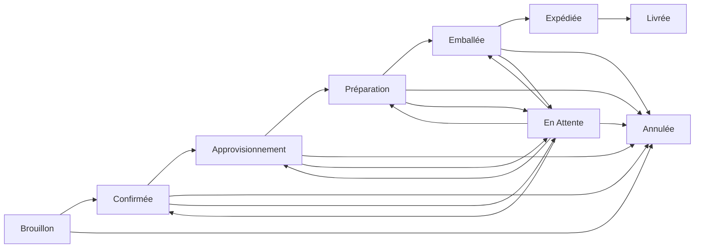

# Traitement des Commandes

Suivez les commandes d'approvisionnement des yachts tout au long de leur cycle de vie complet.

## Flux de Travail des Commandes

Les commandes suivent ce cycle de vie :

### Statuts des Commandes

| Statut | Description |
|--------|-------------|
| Brouillon | La commande est en cours de préparation |
| Confirmée | La commande est confirmée et le traitement commence |
| Approvisionnement | Les articles sont en cours d'approvisionnement |
| Préparation | Les articles sont en cours de préparation |
| Emballée | Les articles sont emballés et prêts à l'expédition |
| Expédiée | La commande est en transit |
| Livrée | La commande a été livrée |
| Annulée | La commande a été annulée (accessible depuis Brouillon, Confirmée, Approvisionnement, Préparation, Emballée, En Attente) |
| En Attente | La commande est temporairement suspendue (accessible depuis Confirmée, Approvisionnement, Préparation, Emballée ; peut revenir à ces statuts ou être Annulée) |

### Champs de la Commande

| Champ | Description |
|-------|-------------|
| Numéro de Commande | Identifiant unique de la commande |
| Client | Fiche client associée |
| Statut | Statut actuel de la commande |
| Date Limite de Livraison | Date de livraison requise |
| Adresse de Livraison | Destination d'expédition |
| Nom du Yacht | Yacht cible pour l'approvisionnement |
| Instructions Spéciales | Notes de livraison supplémentaires |
| Montant Total | Total calculé de la commande |
| Assignée À | Utilisateur responsable de la commande |
| Créée Par | Utilisateur ayant créé la commande |
| Confirmée Le | Horodatage de la confirmation |
| Expédiée Le | Horodatage de l'expédition |
| Livrée Le | Horodatage de la livraison |
| ID Tâche Kanban | Lien vers la tâche du tableau kanban |

## Création d'une Commande

1. Accédez aux **Commandes**
2. Cliquez sur **Créer une Commande**
3. Remplissez les détails de la commande :
   - **Client** - Sélectionnez un client dans la liste des clients
   - **Adresse de Livraison** - Destination d'expédition
   - **Nom du Yacht** - Yacht cible
   - **Date Limite de Livraison** - Date de livraison requise
   - **Instructions Spéciales** - Notes supplémentaires éventuelles
4. Ajoutez les articles
5. Enregistrez comme brouillon ou confirmez

## Gestion des Articles de Commande

Chaque commande contient des articles avec :

- Référence produit
- Quantité commandée
- Prix unitaire
- Quantité préparée
- Quantité emballée

## Historique des Commandes

Toutes les modifications de commande sont suivies dans le journal d'audit :

- Changements de statut
- Ajouts/suppressions d'articles
- Modifications de quantité
- Changements d'affectation
