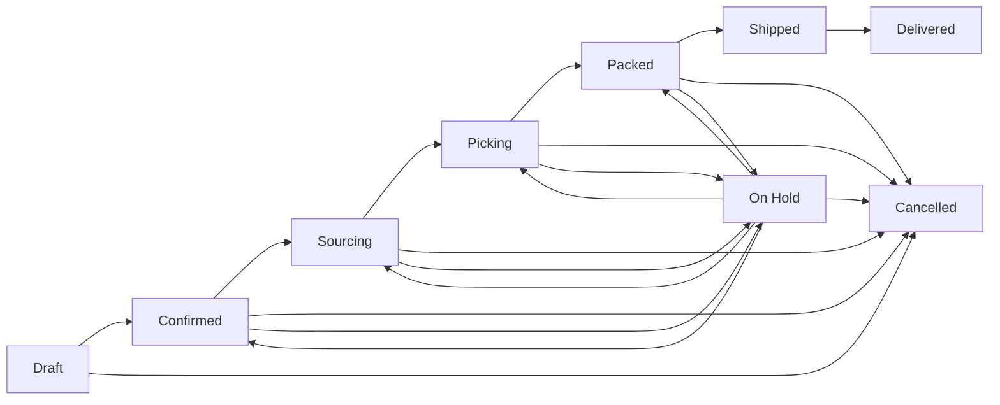

# Order Processing

Track yacht provisioning orders through their complete lifecycle.

## Order Workflow

Orders follow this lifecycle:

### Order Statuses

| Status | Description |
|--------|-------------|
| Draft | Order is being prepared |
| Confirmed | Order is confirmed and processing begins |
| Sourcing | Items are being sourced from suppliers |
| Picking | Items are being picked from inventory |
| Packed | Items are packed and ready for shipping |
| Shipped | Order is in transit |
| Delivered | Order has been delivered |
| Cancelled | Order was cancelled (reachable from Draft, Confirmed, Sourcing, Picking, Packed, On Hold) |
| On Hold | Order is temporarily paused (reachable from Confirmed, Sourcing, Picking, Packed; can return to those statuses or be Cancelled) |

### Order Fields

| Field | Description |
|-------|-------------|
| Order Number | Unique order identifier |
| Client | Linked client record |
| Status | Current order status |
| Delivery Deadline | Required delivery date |
| Delivery Address | Shipping destination |
| Yacht Name | Target yacht for provisioning |
| Special Instructions | Additional delivery notes |
| Total Amount | Computed order total |
| Assigned To | User responsible for the order |
| Created By | User who created the order |
| Confirmed At | Timestamp when order was confirmed |
| Shipped At | Timestamp when order was shipped |
| Delivered At | Timestamp when order was delivered |
| Kanban Task ID | Link to kanban board task |

## Creating an Order

1. Navigate to **Orders**
2. Click **Create Order**
3. Fill in order details:
   - **Client** - Select a client from the client list
   - **Delivery Address** - Shipping destination
   - **Yacht Name** - Target yacht
   - **Delivery Deadline** - Required delivery date
   - **Special Instructions** - Any additional notes
4. Add line items
5. Save as draft or confirm

## Managing Order Items

Each order contains line items with:

- Product reference
- Quantity ordered
- Unit price
- Quantity picked
- Quantity packed

## Order History

All order changes are tracked in the audit log:

- Status changes
- Item additions/removals
- Quantity changes
- Assignment changes
