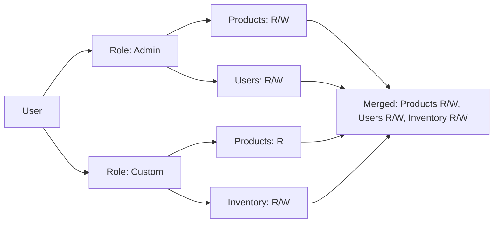

# Users & Roles

LibreStock uses role-based access control (RBAC) to manage what each user can see and do. Roles contain permissions, and users are assigned one or more roles.

## Understanding Permissions

Permissions are defined as a combination of **Resource** and **Permission level**:

| Resource | Description |
|----------|-------------|
| DASHBOARD | Home dashboard |
| STOCK | Stock overview and movements |
| PRODUCTS | Product catalog |
| LOCATIONS | Locations and areas |
| INVENTORY | Inventory records |
| AUDIT_LOGS | Audit log viewer |
| USERS | User management |
| SETTINGS | Application settings |
| ROLES | Role management |

Each resource supports two permission levels:

| Level | Description |
|-------|-------------|
| **READ** | View data |
| **WRITE** | Create, update, and delete data |

!!! info "Default Permissions"
    Users with no roles assigned receive default permissions: Dashboard (read) and Settings (read/write).

## System Roles

Four built-in roles are created automatically on first startup:

| Role | Permissions |
|------|-------------|
| **Admin** | Full access — all resources, read and write |
| **Warehouse Manager** | Stock, Products, Locations, Inventory (R/W) + Settings (R/W) |
| **Picker** | Stock, Products, Locations (read) + Inventory (R/W) + Settings (R/W) |
| **Sales** | Stock, Products, Inventory (read) + Settings (R/W) |

!!! warning "System roles cannot be deleted"
    The four built-in roles are marked as system roles and cannot be removed. You can create additional custom roles to suit your organization.

## Managing Roles

### Viewing Roles

Navigate to **Settings > Roles** to see all roles. Each role shows its name, description, and whether it's a system role.

### Creating a Custom Role

1. Click **Create Role**
2. Enter a **Name** and **Description**
3. Use the **Permissions Matrix** to select which resources the role can read or write
4. Click **Save**

The permissions matrix displays a grid of resources (rows) and permission levels (columns). Check the boxes to grant access.

### Editing a Role

1. Click on a role to open the edit form
2. Modify the name, description, or permissions
3. Click **Save**

!!! tip "Permission Changes Take Effect Quickly"
    Permission lookups are cached for 1 minute. After changing a role's permissions, affected users will see the changes within 60 seconds without needing to log out.

### Deleting a Role

1. Click the delete button on a custom role
2. Confirm the deletion

System roles cannot be deleted. Custom roles can only be deleted if they are not currently assigned to users.

## Managing Users

### Viewing Users

Navigate to **Settings > Users** to see all user accounts. The user list shows:

- **Name** - Display name
- **Email** - Login email
- **Roles** - Assigned roles
- **Status** - Active, banned, etc.
- **Created** - Account creation date

Use the search bar to find users by name or email. Filter by role to see all users with a specific role.

### Assigning Roles

1. Click on a user to open their profile
2. Click **Update Roles**
3. Select one or more roles from the list
4. Click **Save**

Users can have multiple roles. Permissions are merged — a user gets the union of all permissions from their assigned roles.

### Banning a User

If you need to temporarily or permanently restrict a user:

1. Click on the user
2. Click **Ban User**
3. Enter a **Reason** for the ban
4. Optionally set an **Expiry Date** for a temporary ban
5. Confirm

Banned users are immediately logged out and cannot sign in until unbanned or the ban expires.

### Unbanning a User

1. Click on the banned user
2. Click **Unban User**
3. Confirm

### Revoking Sessions

To force a user to log in again (e.g., after a security concern):

1. Click on the user
2. Click **Revoke Sessions**
3. Confirm

This invalidates all active sessions. The user will need to sign in again.

### Deleting a User

1. Click on the user
2. Click **Delete User**
3. Confirm

!!! danger "User deletion is permanent"
    Deleting a user removes their account entirely. Audit logs referencing the user will retain the user ID but the account cannot be recovered.

## Permission Resolution

When a user makes a request, the system resolves their permissions by:

1. Loading all roles assigned to the user
2. Collecting all permissions from those roles
3. Merging permissions (union) — if any role grants access, the user has access

## Best Practices

1. **Use the principle of least privilege** — Assign the minimum roles needed for each user's job
2. **Create custom roles for specialized needs** — Don't modify system roles; create new ones
3. **Review role assignments periodically** — Remove unnecessary permissions as responsibilities change
4. **Use ban with expiry for temporary restrictions** — Avoids forgetting to unban later
5. **Revoke sessions after role changes** — Ensures the user picks up new permissions immediately
